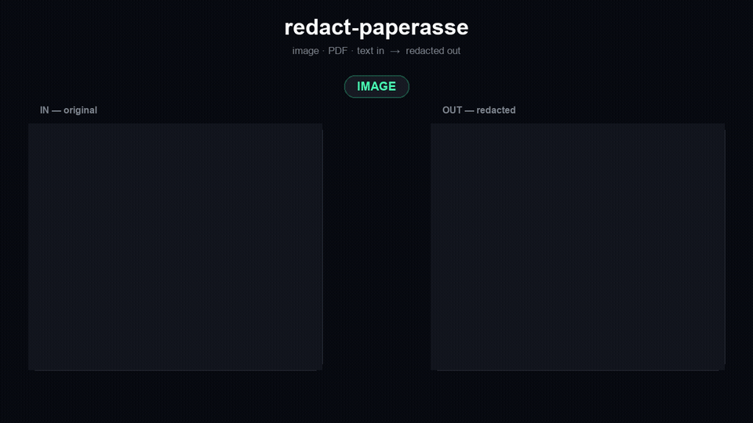

# redact-paperasse

A privacy engine for agents: image, PDF, office document, or text in → redacted image, PDF, or text out. For the text path, markdown is the default output shape (agents parse it best) — pass `markdown: false` to get plain text back instead. Built to run *inside* the host process via native language bindings, not only as a REST call — fast enough that an agent can call it on the hot path.

**Try it: [redact.paperasse.ai](https://redact.paperasse.ai)** — upload text, an image, or a PDF, pick which kinds of PII to redact, and get the redacted file back. Nothing is stored: the upload is redacted in memory and streamed back in the same request. Source for the demo is at [PaperasseAI/redact-paperasse-demo](https://github.com/PaperasseAI/redact-paperasse-demo).



*Every frame is real tool output — the ID card's SSN and the PDF are redacted by the actual CLI, not mocked up. All identifiers shown are synthetic.*
> **Status: early, but working.** `cargo test --workspace` passes (66 tests) and `cargo clippy --all-features -D warnings` is clean on both the native host target and `wasm32-unknown-unknown`. The full ingest → detect → redact pipeline is implemented for text, images, PDFs, and office documents (DOCX/XLSX/PPTX/RTF/EPUB/ODT/CSV) — including pixel redaction and PDF reassembly, not just the text path — and both the image and PDF redaction paths have been run end to end against a real photographed French document with a correct, pixel-precise result. CI runs the full check suite on every push. See [Build status](#build-status) for the details.

## Architecture

```text
Input (image | pdf | office document | text)
   │
   ▼
[1] ingest   — anydoc (office formats + text-based PDFs, pure Rust, no OCR)
               or liteparse (scanned/image PDFs, plain images — PDFium +
               optional OCR, the only path that gives bounding boxes)
   │
   ▼
[2] detect   — Tier A: in-process regex+checksum recognizers (default,
               zero network hop — see crates/recognizers), filterable by
               entities/score_threshold (mirrors Presidio's own fields)
               Tier B: optional REST call to a Presidio deployment, for
               NER (names, locations, context-dependent entities) Tier A
               structurally can't cover
   │
   ▼
[3] redact   — mask text/markdown spans, or fill pixel bounding boxes
   │
   ▼
Output (redacted image | redacted pdf | redacted text | markdown)
```

### Why two ingestion libraries, not one

[anydoc](https://github.com/firecrawl/anydoc) and [liteparse](https://github.com/run-llama/liteparse) both touch PDFs, so naively depending on both for everything would mean two overlapping PDF parsers and liteparse's PDFium/Tesseract weight paid for documents that don't need it. Instead they're scoped to non-overlapping jobs:

- **anydoc** owns every office format (DOCX/XLSX/PPTX/RTF/EPUB/ODT/CSV) plus text-based PDFs. Pure Rust, no native binary dependency, ~5ms median. This covers the large majority of real documents.
- **liteparse** owns *only* what anydoc structurally can't do: scanned/image-only PDFs and plain images, via PDFium + optional OCR (bundled Tesseract, or a pluggable HTTP OCR server). This is also the only ingestion path that produces bounding boxes, which is what makes pixel-level redaction placement possible at all.

Neither library is forked or modified — both are consumed as ordinary crates.io dependencies through their public APIs (anydoc's `to_markdown_bytes`; liteparse's `LiteParse::parse_input` → `ParseResult { pages, text, .. }` with each page's `text_items` carrying `(x, y, width, height)`).

### Why two detection tiers, not one

Regex+checksum recognizers (SSNs, the French NIR, IBANs, emails — a fixed identifier format with a real validation algorithm) are cheap, deterministic, and portable to any language with zero ML dependency. General NER (names, locations, anything context-dependent) needs a real NLP stack and is meaningfully less certain — in testing against a real document while building the `FR_NIR` recognizer for Presidio (on the [`paperasse-fr-nir` branch](https://github.com/PaperasseAI/presidio/tree/paperasse-fr-nir) of `data-privacy-stack/presidio`), the checksum-validated match was the reliable signal; the NER layer's guesses (misclassifying an account number as a date, a dossier number as a UK health-service number) were the wrong ones.

So Tier A — the regex+checksum layer — is the default, in-process, zero-network path (`crates/recognizers`), meant to run inside the same process as the caller via the native bindings. Tier B is an explicit opt-in REST call to a Presidio deployment, for when Tier A's coverage genuinely isn't enough and the latency/network hop is worth it. Both tiers accept the same two filters (`entities`, `score_threshold`), matching Presidio's own `analyzer_entities`/`score_threshold` request fields — see `Engine::process`.

Tier B is fail-closed by design, not fail-open: if the Presidio deployment is unreachable, the call errors rather than silently degrading to Tier-A-only output that *looks* fully redacted but isn't. It's also currently scoped to text input only — it never has pixel coordinates (`Entity::bbox` is always `None` from Tier B), so a `--tier-b` image/PDF redaction request refuses outright instead of silently skipping the entities it can't place on the page.

## Repo layout

```
crates/
  core/         redact-paperasse-core — the pipeline (ingest/detect/redact)
  recognizers/  redact-paperasse-recognizers — Tier A: FR_NIR, EMAIL_ADDRESS,
                US_SSN, IBAN_CODE, CREDIT_CARD, PHONE_NUMBER
  cli/          `redactpapr` binary (--features tier-b for the Presidio flag)
bindings/
  node/         napi-rs (redact-paperasse on npm) — see example.mjs
  python/       PyO3 + maturin (redact-paperasse on PyPI)
  wasm/         wasm-bindgen, browser-only — Tier A text redaction only,
                see "Build status" for why pixel redaction can't exist here
```

## Adding a Tier A recognizer

Each recognizer is a self-contained module in `crates/recognizers/src/` implementing the `Recognizer` trait (`entity_type()` + `analyze(text) -> Vec<Match>`) with its own `#[cfg(test)]` block. Register new recognizers in `default_registry()` in `lib.rs`.

Six are registered today, each honest about how strong its own validation actually is:

- **`fr_nir.rs`** / **`iban.rs`** / **`credit_card.rs`** — a real checksum (`FR_NIR`: INSEE mod-97, `IBAN_CODE`: ISO 7064 mod-97, `CREDIT_CARD`: Luhn). A match that fails the checksum is rejected outright rather than reported at low confidence, so anything returned scores `1.0`.
- **`us_ssn.rs`** — no checksum exists for SSNs; `validate()` instead encodes the same area/group/serial exclusion rules (000/666/900-999, 00, 0000) Presidio's own `UsSsnRecognizer` uses. Scores `0.85`, not `1.0`, to reflect that this is structural plausibility, not a real checksum.
- **`phone_number.rs`** — regex shape + digit-count sanity check only, deliberately narrower than Presidio's `phonenumbers`-backed recognizer (no region-aware validation). Scores `0.75`.
- **`email.rs`** — regex only, no validation beyond the pattern itself. Scores `0.9`.

## Build status

Clean, zero warnings, on everything CI checks (`.github/workflows/ci.yml`):

- `cargo fmt --all --check`, `cargo clippy --workspace --all-features --all-targets -D warnings`, `cargo test --workspace --locked` — native host. **66/66 tests pass.**
- `cargo clippy -p redact-paperasse-wasm --target wasm32-unknown-unknown -D warnings` — the browser binding, checked against the actual wasm32 target, not just the host target the main job validates.
- `cargo check -p redact-paperasse-cli --features tier-b` — the Presidio-calling code path, which is off by default.
- The Node binding is built for real (`napi build --platform`) and exercised with `example.mjs` against the actual compiled addon, not just type-checked.

This is real, not aspirational — getting here caught and fixed several genuine bugs, not just typos:

1. A byte-offset-vs-char-index bug in `mask_text` (was collecting into a `Vec<char>` while spans are byte offsets from `regex`) — caught by the FR_NIR recognizer's own "found within surrounding French text" test, where three accented characters shifted every mask out of position. Fixed to slice `&str` directly; regression tests added in `redact.rs`.
2. An ingestion-routing gap: a PDF with a real text layer went through anydoc (fast, but produces no bounding boxes and can't see PII inside embedded images), while `OutputFormat::Native` output always tried to draw boxes — meaning PII correctly *detected* via the text path was silently never *redacted* in the pixel output. Fixed: `Ingestor::ingest` takes a `needs_boxes` hint now; any `OutputFormat::Native` PDF always routes through liteparse regardless of whether it has a text layer, and `AnydocIngestor` actively refuses (`EngineError::Unsupported`) rather than silently under-redact.
3. printpdf 0.9.1's real `PdfDocument::save` signature (needs a `&mut Vec<PdfWarnMsg>` the docs example omits).
4. liteparse 2.11.1 itself doesn't compile cleanly for `wasm32` with default features (an unconditional `use` of a module that's correctly `wasm32`-gated at declaration, but not at the import site) — worked around via a workspace-inheritance-correct feature split (native builds opt into `tesseract` explicitly; wasm32 gets liteparse's bare default). Also: `default-features` can only be overridden *downward* if the workspace-level entry is already `false` — a member crate can't turn off a workspace-`true` default, only add features on top of a workspace-`false` baseline. Took a second pass to get this ordering right.
5. **A real upstream constraint, not a bug**: `LiteParse::screenshot_input` — which `redact_pdf_bytes` depends on for pixel-level PDF redaction — doesn't exist in liteparse's wasm32 build at all (no PDFium-to-raster path there). So pixel-level PDF/image redaction is `#[cfg(not(target_arch = "wasm32"))]`-gated; the wasm32 binding only exposes Tier A text redaction, which is what actually runs client-side in a browser anyway.
6. **`Input` originally had no way to represent a DOCX/XLSX/PPTX/CSV/etc. document at all** — only `Text | Pdf | Image` — despite anydoc's office-format coverage being a core part of the architecture's rationale. Discovered while writing direct tests for the ingest routing logic: there was no way to even construct a test case for it. Added `Input::Document { bytes, format: Option<DocumentFormat> }`, wired through all three `Ingestor` impls, with `OutputFormat::Native` correctly rejected for it (anydoc only ever converts *to* markdown, never back to a native office format).
7. Two real `cargo test`/`clippy` catches during the same pass: a partial-move borrow-checker error in the CLI (`cli.r#as.unwrap_or_else(...)` moved a field out from under a later `&cli` borrow — fixed with `.clone()`), and a `#[cfg(feature = "tier-b")]`-gated function called from a call site that wasn't itself feature-gated (compiled under `--features tier-b`, failed under default features) — both caught by actually running both build configurations, not just one.
8. **The bbox lookup in `TierA::analyze` only ever matched a span fully contained in one OCR word token.** A NIR written with spaces ("1 85 01 75 123 456 09") OCRs as seven separate tokens, so the regex match spanning all seven never matched any single `word_box` — `bbox` silently came back `None`, and `draw_redaction_boxes` skips any entity without one, so the match was correctly *found* (visible in `--report`'s JSON) but never actually drawn on the image/PDF. The real photographed document's NIR happened to be written *without* spaces (one OCR token), which is why that case worked and this one didn't — same bug class as #2 above (detected but not redacted), just a different trigger. Found by `bindings/node/example.mjs`'s own fixture-based test (see below), fixed by computing the *union* of every overlapping `word_box`, not requiring full containment in one (`detect::tier_a::union_bbox`, with direct unit tests for the single-token, multi-token, no-overlap, and cross-page cases).

9. **Every JPEG failed to redact.** Redaction draws boxes on an RGBA buffer, then re-encodes in the source format — but JPEG has no alpha channel, and `image`'s encoder rejects `Rgba8` outright (`The encoder or decoder for Jpeg does not support the color type Rgba8`). PNG has alpha, so every fixture in this repo passed while the format that actually matters — photographed paperwork is overwhelmingly JPEG — was broken for every user. Found only when a real photo was uploaded to the live demo at [redact.paperasse.ai](https://redact.paperasse.ai); no amount of the existing PNG-only testing would ever have caught it. Fixed by dropping the alpha channel when the target format can't encode it (lossless here: the source is opaque and the drawn boxes are opaque), with JPEG handled explicitly and a retry-as-RGB8 fallback for any other alpha-less format rather than trying to enumerate the full list correctly. Regression tests now cover both a real JPEG and a real PNG round-trip (`redact::tests`).

10. **A page could carry the same identifier twice and only one got redacted.** On a real scanned URSSAF letter the NIR appears in the reference block *and* again in the detachable payment coupon; only the first was covered. Not a recognizer bug and — despite the obvious first guess — not resolution: running the same page at 150 vs 300 DPI produced byte-identical detections, because liteparse OCRs an image at its native size and `dpi` only governs PDF rasterization. The real cause is Tesseract's page segmentation: on a busy full page it never isolates the small dense coupon block, so that text is never emitted and the recognizer never sees it. Same pixels cropped, it reads fine every time. Fixed with a supplementary overlapping-tile OCR pass for images (`LiteparseIngestor::ingest_image_tiled`), merged by box (`merge_by_box`) so overlap duplicates don't inflate the report. Verified on the original page: 1 of 2 before, 2 of 2 after, both boxes pixel-accurate. Costs roughly one extra OCR pass, and only runs when pixel boxes are actually needed.

11. **Every photo taken on a phone silently redacted nothing.** Cameras store pixels in the sensor's orientation plus an EXIF tag saying how to rotate them for display. Viewers honour the tag, so the photo looks upright to whoever uploads it — but `image`'s `decode()` ignores it, so OCR was handed sideways text and matched nothing at all. The user then got their file back *unredacted and visibly rotated*, because re-encoding dropped the tag too. Diagnosed from that second symptom (credit to the user, who spotted that the rotation was coming from the backend). Proven with a pair of otherwise identical files: upright pixels gave 3 detections, the same content stored sideways with an orientation tag gave 0. Fixed by applying the tag once at the entry point in `Engine::process`, before ingest — not inside `redact_image_bytes`, since rotating only at redaction time would place boxes using coordinates from a differently-oriented OCR pass. Now 3/3 on upright, 90° and 180° fixtures.

12. **The orientation fix above only helped files that admitted they were rotated.** An EXIF tag is a courtesy, not a guarantee — messaging apps strip it, many scanners never write one, and a screenshot has none. So a page can be stored sideways with nothing in the file to say so, and the fix in 11 does nothing for it. This is the worse case, because the person uploading has no way to know: their gallery shows the page upright either way. Expecting them to rotate it by hand is not a fix, it's a shifted burden. Now, when an image yields *no* detections, the engine retries at 90/180/270 and keeps whichever orientation actually reads, redacting and returning that one — so the file also comes back upright. Verified on sideways PNGs (a format that cannot carry an orientation tag at all): the redacted output is pixel-identical to redacting the upright original. Costs three extra OCR passes, but only on the empty result, so a normal upright page pays nothing.

### Verified against a real document, not just a compiler

`redactpapr` run end to end (`ingest → Tier A → redact`, `OutputFormat::Native`) against a real photographed French URSSAF letter — the exact same document used earlier to validate the `FR_NIR` Presidio recognizer this whole project grew out of — both as a **plain image** and as that same image **embedded in a PDF** (to exercise the PDF-specific render → redact → reassemble path separately). Both times: the NIR field was correctly detected (`FR_NIR`, score 1.0, real `bbox` coordinates) and the redaction box landed pixel-precise on it — nothing else on the page (name, address, other reference numbers, signature) was touched, page dimensions and layout fully intact in the reassembled PDF.

This resolved every item the README used to list as unverified:

1. `LiteparseIngestor::ingest_image` **does** correctly accept a plain image via `PdfInput::Bytes`, per liteparse's own README/flowchart — confirmed by real OCR output (`[liteparse] ocr: 2201.4ms`), not just a passing type check.
2. The DPI assumption in `redact_image_bytes` (liteparse's default 150) **was correct** — the box landed exactly on the target text, not offset.
3. The `XObjectTransform`/page-sizing math in `redact_pdf_bytes` **was correct** — the redacted page image scaled and positioned exactly onto its `PdfPage`, no cropping, stretching, or offset in the reassembled PDF.

Along the way this also surfaced a real bug in a dependency, not in this code: `tesseract-rs`'s build script downloads its language data (`eng.traineddata`, `tur.traineddata`) but only checks the file *exists* before skipping re-download, not that it's valid — an earlier network timeout during this project's own build left 0-byte stub files that `tesseract-rs` happily "found" on every subsequent build, failing at OCR *runtime* with "Failed to initialize Tesseract" rather than at build time. Fixed locally by deleting the corrupt files and `cargo clean -p tesseract-rs` to force a real re-download; worth keeping in mind if this ever recurs (e.g. after a CI runner's cache gets a similarly-interrupted first build).

### `redactImage`/`redactPdf` — now exposed in every binding, and CI-tested for real

All three bindings now expose pixel redaction directly, not just `redactText`: Node's `redactImage`/`redactPdf`, Python's `redact_image`/`redact_pdf`, and WASM's `redactImage` (no `redactPdf` there — same wasm32 constraint as the core crate). `bindings/node/fixtures/` holds small synthetic test images (`sample.png`, generated with a real TrueType font at a readable size — a first attempt with PIL's tiny default bitmap font produced OCR garbage, the same class of lesson as the DPI notes above) containing fake PII, checked into the repo (unlike the real photographed document above, which stays local/gitignored). `example.mjs` redacts both and is run in CI, so the pixel-redaction path — not just the text path — is exercised on every push, not only manually. This fixture is exactly what caught bug #8 above.

## Publishing

`.github/workflows/publish.yml` builds and publishes to crates.io, npm, and PyPI on a `vX.Y.Z` tag push — see that file's header comment for the required repo secrets and, importantly, which parts of it haven't actually been exercised by a real release yet, as distinct from `ci.yml`'s checks, which run and are verified on every push.

**crates.io: live.** [`redact-paperasse-recognizers`](https://crates.io/crates/redact-paperasse-recognizers), [`redact-paperasse-core`](https://crates.io/crates/redact-paperasse-core), and [`redact-paperasse-cli`](https://crates.io/crates/redact-paperasse-cli) are all published — `cargo install redact-paperasse-cli` gets you the `redactpapr` binary today.

**PyPI: live, but v0.1.0 shipped a real bug — fixed in v0.1.1.** [`redact-paperasse`](https://pypi.org/project/redact-paperasse/) published all 3 platform wheels for real. Installing v0.1.0 from PyPI into a fresh venv and calling `redact_image`/`redact_pdf` panicked with "could not find pdfium shared library": liteparse-pdfium loads PDFium at runtime via `dlopen`, not at link time, so it's invisible to maturin's automatic shared-library bundling, and the wheel shipped without its own runtime dependency. Every other function (`redact_text`, all four Tier A entity types) worked correctly on the real published package — only pixel redaction was affected. Fixed in v0.1.1 by bundling the pdfium library next to the compiled extension inside the wheel (`scripts/bundle_pdfium_into_wheel.py`), exploiting a search path the crate already checks (`self_dir()` via `dladdr`) — verified for real by patching a locally built wheel the same way, installing it in a fresh venv, and confirming `redact_image`/`redact_pdf` now work.

**npm: same pdfium bug, fixed before its first publish.** The package follows napi-rs's standard multi-platform layout: the root `redact-paperasse` package ships only JS/TS (no bundled binary — see its `files` field) and depends on five per-platform packages (`redact-paperasse-{darwin-x64,darwin-arm64,linux-x64-gnu,linux-arm64-gnu,win32-x64-msvc}`) via `optionalDependencies`. The same pdfium bug that hit the published PyPI wheel was verified to affect the `.node` addon too — confirmed locally by hiding this machine's pdfium cache directory to simulate a foreign machine and watching `redactImage` fail without a bundled library and succeed with one placed next to the `.node` file. `publish.yml` bundles it the same way before publishing each platform subpackage. Not yet actually published — a first real attempt got 4 of 5 platforms built (`darwin-x64`/Intel got stuck on a scarce GitHub runner pool, not a bug) but was superseded by the v0.1.1 version bump before `npm-publish` ran.

## License

MIT — see `NOTICE.md` for a full audit of the dependency tree's own licenses (all permissive; no GPL/AGPL/SSPL anywhere in it, checked by CI's `license-check` job on every push).
